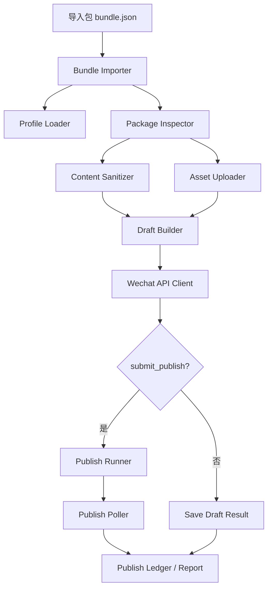

# 微信公众号自动发布适配层设计稿

**工作区根目录**：`/Users/clngs/Documents/CLngs_Vault/WeChat_Publisher_System`

**状态**：已确认方向，等待实现计划

## 1. 背景

现有 Research Media Writer 工作区已经可以把研究稿整理成公众号可发布包，但它的职责止于本地预览、平台打包和发布前复审。公众号“真实发布”属于另一类工程问题：它需要独立的账号配置、接口调用、素材上传、草稿创建、发布状态跟踪和失败回收。

为了避免把两套工作流混在一个工作区里，本项目单独建立 `WeChat_Publisher_System` 工作区。它只负责一件事：把已经成型的文章包，自动送进微信公众号草稿箱，并在显式开关打开时继续提交发布。

## 2. 目标

本设计的目标是让系统具备以下能力：

1. 接收一个已经打包好的公众号文章包。
2. 自动上传正文图片和封面素材到微信侧。
3. 自动组装微信草稿并保存到草稿箱。
4. 在显式开关开启时，提交草稿发布并轮询发布状态。
5. 全程保留可追踪、可重放、可排障的本地记录。

默认成功标准只到“草稿创建成功”。真实发布必须由显式配置开启。

## 3. 非目标

本版本不做以下事情：

- 不负责文章改写、证据抽取、视觉规划和图片生成。
- 不负责公众号后台的浏览器模拟操作。
- 不负责人工审核流程。
- 不负责其他平台的发布。
- 不直接读取 RMW 工作区内部 runtime 结构作为耦合依赖。

## 4. 工作区边界

这个工作区是独立工程。它不和 `research-media-writer-v3` 共享工作流目录，也不读取那边的阶段状态文件。

上游 Writer 工作区只需要输出一个稳定的“发布包”，再把这个包复制或导出到本工作区的导入区。建议采用文件式交接，而不是跨工作区直接引用内部运行时路径。

推荐的交接方式如下：

```text
WeChat_Publisher_System/
  imports/
    <job_id>/
      bundle.json
      article.html
      article.md
      assets/
      cover/
```

本工作区只消费导入包，不依赖 Writer 的内部对象编号、stage 计划文件或 review 记录。

## 5. 总体架构



核心思想是把“内容处理”“素材上传”“草稿创建”“发布提交”“状态追踪”拆开。这样微信接口、内容规则或资产格式一旦变化，只需要动对应模块，不会拖垮整条链路。

## 6. 模块设计

### 6.1 `Bundle Importer`

职责：

- 读取导入包目录。
- 校验 `bundle.json` 是否齐全。
- 把文章正文、封面、图片和元数据归一到内部标准结构。

依赖：

- 导入目录中的 `bundle.json`
- `article.html`
- `article.md`
- `assets/`
- `cover/`

输出：

- 标准化的 `PublishBundle`
- 包哈希 `package_hash`
- 校验结果

### 6.2 `Profile Loader`

职责：

- 读取微信账号配置。
- 解析环境变量和本地 profile 文件。
- 决定当前运行是“只建草稿”还是“建草稿后提交发布”。

建议配置项：

```yaml
account_profile: default
app_id_env: WECHAT_MP_APP_ID
app_secret_env: WECHAT_MP_APP_SECRET
submit_publish: false
force_new_draft: false
poll_timeout_seconds: 120
poll_interval_seconds: 5
default_author: ""
need_open_comment: 0
only_fans_can_comment: 0
```

原则：

- 凭证只从环境变量读取。
- `submit_publish` 默认必须是 `false`。
- 如果没有显式开启发布，系统只保存草稿。

### 6.3 `Package Inspector`

职责：

- 检查标题、摘要、作者、正文 HTML、封面和正文图片是否完整。
- 判断是否存在不适合微信草稿的内容。
- 识别缺失图片、超大图、外链图片、无效路径和无效文件格式。

输出：

- 缺失项列表
- 违规项列表
- 可上传资产清单
- 可进入草稿的正文清单

### 6.4 `Content Sanitizer`

职责：

- 把本地 HTML 转成微信可接受的正文。
- 清理本地绝对路径、内部对象号、运行记录和不支持的标签。
- 将正文中的图片引用替换成微信上传后返回的 URL。

关键规则：

- 正文里不保留本地文件路径。
- 不保留内部系统名、对象编号和 runtime 记录。
- 不把未上传图片直接写进草稿正文。
- 如果遇到不支持的片段，必须阻断，不做“猜测式降级”。

### 6.5 `Asset Uploader`

职责：

- 上传正文图片到 `/cgi-bin/media/uploadimg`。
- 上传封面到永久素材接口，获取 `thumb_media_id`。
- 维护本地资产到微信侧资产的映射表。

注意：

- 正文图片使用 `uploadimg` 返回的 URL。
- 封面使用永久素材 `media_id`，通常通过 `material/add_material` 处理。
- 上传失败要记录原文件、hash、尝试次数和返回码。

### 6.6 `Draft Builder`

职责：

- 组装微信草稿 JSON。
- 填充标题、作者、摘要、正文内容、封面 `thumb_media_id`、评论开关等字段。
- 调用 `/cgi-bin/draft/add` 保存草稿。

输出：

- `wechat-draft-payload.json`
- 微信返回的草稿 `media_id`

### 6.7 `Publish Runner`

职责：

- 只有在 `submit_publish: true` 时工作。
- 调用 `/cgi-bin/freepublish/submit` 提交草稿。
- 记录 `publish_id`。

### 6.8 `Publish Poller`

职责：

- 轮询 `/cgi-bin/freepublish/get`。
- 等待发布状态进入终态。
- 记录最终 `publish_status`、`article_id` 和文章永久链接。

发布状态只记录，不自动重发。

### 6.9 `Publish Ledger`

职责：

- 保存本次运行的所有关键证据。
- 为重复执行提供幂等依据。
- 给后续排障留下可读报告。

建议输出文件：

```text
runtime/publish-jobs/<job_id>/
  publish-ledger.json
  asset-upload-map.json
  wechat-draft-payload.json
  wechat-publish-result.json
  wechat-publish-report.md
  raw-responses/
```

## 7. 数据契约

### 7.1 导入包 `bundle.json`

最小字段建议如下：

| 字段 | 说明 |
|---|---|
| `job_id` | 本次发布任务 ID |
| `object_id` | 上游文章对象 ID 或外部文章编号 |
| `title` | 文章标题 |
| `author` | 作者 |
| `digest` | 摘要 |
| `article_html` | 正文 HTML 相对路径 |
| `article_md` | 正文 Markdown 相对路径 |
| `cover_path` | 封面路径 |
| `asset_paths` | 正文图片路径列表 |
| `source_bundle_hash` | 上游包哈希 |
| `platform` | 固定为 `wechat` |
| `publish_mode` | 上游建议模式，仅作参考 |

路径约定：

- `article_html`、`article_md`、`cover_path` 和 `asset_paths` 都按 bundle 根目录解析。
- 如果 bundle 同时提供上游建议模式和本地 profile 开关，以本地 profile 的 `submit_publish` 为准。
- `publish_mode` 不能绕过本地显式开关。

### 7.2 发布台账 `publish-ledger.json`

建议字段：

| 字段 | 说明 |
|---|---|
| `job_id` | 运行 ID |
| `object_id` | 上游对象 ID |
| `account_profile` | 使用的账号配置 |
| `package_hash` | 导入包哈希 |
| `draft_media_id` | 草稿 media_id |
| `publish_id` | 发布任务 ID |
| `publish_status` | 发布状态 |
| `article_url` | 微信侧文章永久链接 |
| `asset_map` | 本地图片到微信 URL 的映射 |
| `started_at` | 开始时间 |
| `finished_at` | 结束时间 |
| `status` | `draft_saved` / `published` / `blocked` / `failed` |

## 8. 运行流程

### 8.1 默认流程

1. 导入 bundle。
2. 校验配置和素材。
3. 上传正文图片。
4. 上传封面素材。
5. 清洗正文 HTML。
6. 组装草稿 payload。
7. 调用新增草稿接口。
8. 写入台账和报告。

### 8.2 发布流程

如果 `submit_publish: true`：

1. 在草稿创建成功后调用发布提交接口。
2. 记录 `publish_id`。
3. 按轮询间隔查询发布状态。
4. 直到成功、失败或超时。
5. 写入最终结果。

## 9. 错误处理

错误分级采用保守策略。

### 9.1 阻断类错误

以下错误直接阻断，不自动继续：

- 凭证缺失或无效。
- 接口无权限。
- 安全 IP 不匹配。
- 正文仍含本地路径或未上传图片。
- HTML 明显超限或包含不允许的内容。
- 封面或正文资产缺失。

### 9.2 可重试错误

以下错误可以有限重试：

- 网络超时。
- 微信接口短暂 5xx。
- 单张图片上传偶发失败。

建议重试策略：

- 指数退避。
- 单图最多 3 次。
- 草稿创建最多 2 次。
- 发布提交只在明确幂等保护下重试。

### 9.3 平台失败

发布提交成功不代表最终发布成功。若微信返回以下状态，要记为平台级失败，不做自动重发：

- 原创失败
- 常规失败
- 平台审核不通过
- 成功后被删除或被封禁

## 10. 幂等与重复提交控制

必须建立幂等键，建议为：

```text
object_id + package_hash + account_profile
```

规则：

- 同一包已经成功创建草稿时，默认不再创建第二份草稿。
- 同一包已经提交发布时，默认不重复 submit。
- 只有显式设置 `force_new_draft: true` 才允许重建草稿。

这个设计用于防止网络抖动导致重复发稿。

## 11. 与上游 Writer 工作区的衔接

上游 Writer 工作区只负责生成发布包，不直接调用微信接口。

推荐交接方式：

1. Writer 工作区导出一个标准 bundle。
2. 复制到本工作区的 `imports/<job_id>/`。
3. 本工作区执行导入、草稿、发布。

这能把“内容生产”和“平台投递”切成两条线，避免两个工作流混跑在同一个目录里。

## 12. 测试策略

### 12.1 单元测试

- bundle 解析
- HTML 清洗
- 图片路径替换
- payload 组装
- 幂等键生成
- 错误分类

### 12.2 模拟接口测试

- mock 正文图片上传
- mock 封面上传
- mock 草稿创建
- mock 发布提交
- mock 发布状态轮询

### 12.3 端到端烟雾测试

先只跑 `draft_only`：

- 确认草稿能创建。
- 确认正文图片全部映射到微信 URL。
- 确认封面 media_id 正常。
- 确认没有本地路径泄漏到正文里。

只有在草稿链路稳定后，才测试 `draft_and_publish`。

## 13. 验收标准

本设计可视为完成，当满足以下条件：

1. 一个合法导入包可以自动创建微信草稿。
2. 默认不会自动提交发布。
3. 显式打开发布开关后，可以提交发布并轮询状态。
4. 所有关键资产映射和微信返回值都被写入台账。
5. 失败能被分类为阻断、可重试或平台失败。
6. 整个流程不依赖当前 Writer 工作区的内部 runtime 结构。

## 14. 后续扩展

后续可以继续扩展，但不影响本版核心目标：

- 支持多个公众号账号 profile。
- 支持定时发布。
- 支持发布前人工确认开关。
- 支持失败后导出人工接管包。
- 支持更细的发布报告和审计视图。
